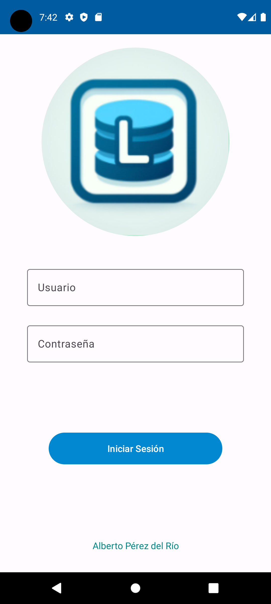
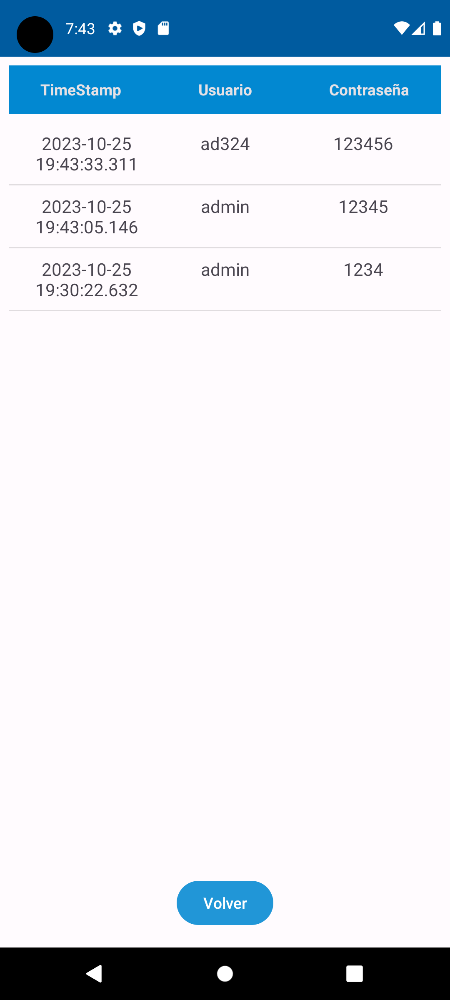

# Simple PHP Login Android

## Descripción

Esta es una aplicación de demostración que presenta un sencillo sistema de inicio de sesión utilizando una base de datos MySQL en un servidor externo con un backend en PHP. Además, muestra ejemplos de cómo obtener información de la base de datos en formato XML y cómo analizarla según sea necesario o mantenerla como XML puro, lo que podría ser útil al diseñar API.

La aplicación consta de dos actividades:

1. **Actividad Principal (`MainActivity.java`)**: Esta es la actividad principal que contiene un formulario de inicio de sesión. Está diseñada de manera responsiva utilizando ConstraintLayout y guías (guidelines) para un diseño flexible. La lógica de interfaz de usuario y la validación inicial de credenciales de inicio de sesión se gestionan aquí. La aplicación utiliza otras clases, como `WebServiceHandler.java` y `XMLParser.java`, para comunicarse con el servidor web y procesar el resultado.

2. **Actividad Exitosa (`ActividadExitosa.java`)**: Esta actividad se muestra después de un inicio de sesión exitoso. Muestra una lista de usuarios recuperados de la base de datos y proporciona un botón para volver a la actividad principal. Si el inicio de sesión falla, se almacena la IP del usuario y la marca de tiempo en una base de datos SQLite local de la aplicación.

## Requisitos

- Android Studio
- Android SDK versión 34
- [XAMPP](https://www.apachefriends.org/index.html) (para el servidor MySQL y PHP en el lado del servidor)

## Características Principales

- Interfaz de inicio de sesión receptiva utilizando ConstraintLayout y pautas (guidelines).
- Comprobación de las credenciales en una base de datos MySQL externa.
- Mostrar la información de la tabla de usuarios en una segunda actividad mediante un ListView después de una autenticación exitosa.
- Manejo de errores en caso de inicio de sesión fallido.
- Registro de intentos fallidos en una base de datos SQLite local, incluyendo la dirección IP y la marca de tiempo.
- Botón de retorno a la actividad principal desde la actividad secundaria.
- Utiliza XML para intercambio de datos y ejemplifica su análisis.

## Archivos del Proyecto

- `ActividadExitosa.java`: Clase que representa la actividad que se muestra después de un inicio de sesión exitoso. Contiene la lógica para mostrar la lista de usuarios y un botón de regreso.

- `MainActivity.java`: Clase que representa la actividad principal de la aplicación, donde se encuentra el formulario de inicio de sesión y la lógica para validar las credenciales.

- `Usuario.java`: Clase que define la estructura de un objeto de usuario, con propiedades como nombre de usuario, contraseña y fecha de nacimiento.

- `UsuarioAdapter.java`: Un adaptador personalizado que se utiliza para mostrar la lista de usuarios en la actividad `ActividadExitosa`.

- `WebServiceHandler.java`: Clase que maneja las solicitudes y respuestas a un servidor web externo, incluida la consulta de usuarios.

- `XMLParser.java`: Clase que se utiliza para analizar documentos XML, en este caso, se usa para analizar las respuestas del servidor web.

## Configuración

Para ejecutar la aplicación de demostración:

1. Asegúrate de tener Android Studio instalado en tu sistema.

2. Configura el servidor web con MySQL y PHP en XAMPP (o un servidor web similar).

3. Actualiza las rutas y URL del servidor web en la aplicación según sea necesario.

4. Ejecuta la aplicación en un emulador o dispositivo Android.

## Licencia

Este proyecto se distribuye bajo la licencia [MIT](LICENSE).

---
**Nota**: Asegúrate de modificar las rutas y las URL del servidor web en la sección de "Configuración" según tus necesidades específicas.
