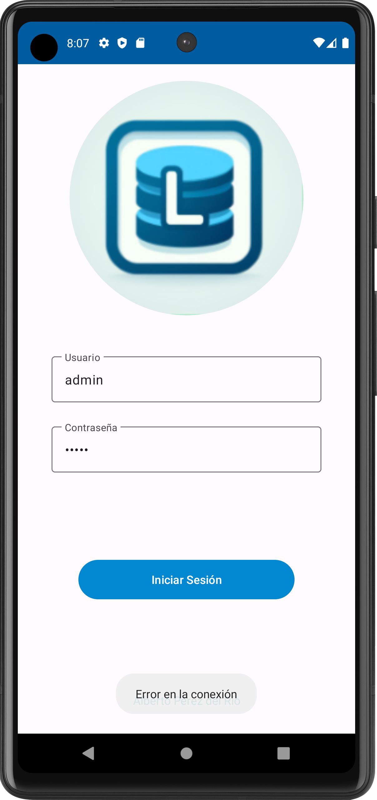

# Casos de Prueba - Simple Login Android

A continuación se detallan los casos de prueba para la aplicación "Simple Login Android" que realiza un inicio de sesión contra una base de datos MySQL utilizando conectores PHP.

## Caso de Prueba 1
- **Descripción del Test Case:** PHP conector validacuenta.php
- **Entrada:** Usuario: "test", Contraseña: "test1234"
- **Acción/Evento:** Realizar una solicitud POST a validacuenta.php
- **Salida Esperada:** Validación de las credenciales en formato XML:

```xml
<respuesta>
    <estado>ko</estado>
</respuesta>
```

<p align="center">
    
</p>


## Caso de Prueba 2
- **Descripción del Test Case:** PHP conector consultausuarios.php
- **Entrada:** ---
- **Acción/Evento:** Llamar a consultausuarios.php
- **Salida Esperada:** Lista de usuarios en formato XML:

```xml
<respuesta>
    <usuario>
        <nombreUsuario>admin</nombreUsuario>
        <contrasena>admin</contrasena>
        <fecha_nacimiento>1986-10-01</fecha_nacimiento>
    </usuario>
    <usuario>
        <nombreUsuario>Usuario1</nombreUsuario>
        <contrasena>Contraseña1</contrasena>
        <fecha_nacimiento>1990-01-01</fecha_nacimiento>
    </usuario>
</respuesta>
```
<p align="center">
    
</p>


## Caso de Prueba 3
- **Descripción del Test Case:** Campos vacíos
- **Entrada:** Usuario: "", Contraseña: ""
- **Acción/Evento:** Intentar iniciar sesión
- **Salida Esperada:** Alerta de que los campos no pueden estar vacíos

<p align="center">
    
</p>

## Caso de Prueba 4
- **Descripción del Test Case:** Nombre de cuenta solo letras y números
- **Entrada:** Usuario: "@test#", Contraseña: "test1234"
- **Acción/Evento:** Intentar iniciar sesión
- **Salida Esperada:** Alerta de que solo se permiten letras y números en el nombre de cuenta

<p align="center">
    
</p>

## Caso de Prueba 5
- **Descripción del Test Case:** Contraseña longitud válida
- **Entrada:** Usuario: "test", Contraseña: "test"
- **Acción/Evento:** Intentar iniciar sesión
- **Salida Esperada:** Alerta de que la contraseña es demasiado corta

<p align="center">
    
</p>

## Caso de Prueba 6
- **Descripción del Test Case:** Contraseña longitud inválida
- **Entrada:** Usuario: "test", Contraseña: "test123456789"
- **Acción/Evento:** Intentar iniciar sesión
- **Salida Esperada:** Alerta de que la contraseña es demasiado larga

<p align="center">
    
</p>

## Caso de Prueba 7
- **Descripción del Test Case:** Validación incorrecta
- **Entrada:** Usuario: "test", Contraseña: "wrongpass"
- **Acción/Evento:** Intentar iniciar sesión
- **Salida Esperada:** Nueva actividad mostrando lista de intentos fallidos con fecha y hora, botón para la pantalla inicial

<p align="center">
    
</p>

## Caso de Prueba 8
- **Descripción del Test Case:** Fallo de conexión a BBDD externa
- **Entrada:** ---
- **Acción/Evento:** Iniciar la aplicación
- **Salida Esperada:** Mensaje de error indicando la falta de conexión a la base de datos externa

<p align="center">
    
</p>

## Resumen


| Caso de Prueba | Descripción del Test Case                          | Entrada                               | Acción/Evento                          | Salida Esperada                                                                 |
|----------------|--------------------------------------------------|---------------------------------------|----------------------------------------|----------------------------------------------------------------------------------|
| 1              | PHP conector validacuenta.php                    | Usuario: "test", Contraseña: "test1234" | Realizar una solicitud POST a validacuenta.php | Validación de las credenciales en formato XML:                               |
|                |                                                  |                                       |                                        | ```xml <respuesta> <estado>ko</estado> </respuesta> ```                        |
| 2              | PHP conector consultausuarios.php                | ---                                   | Llamar a consultausuarios.php          | Lista de usuarios en formato XML:                                               |
|                |                                                  |                                       |                                        | ```xml <respuesta> <usuario> <nombreUsuario>admin</nombreUsuario> <contrasena>admin</contrasena> <fecha_nacimiento>1986-10-01</fecha_nacimiento> </usuario> <usuario> <nombreUsuario>Usuario1</nombreUsuario> <contrasena>Contraseña1</contrasena> <fecha_nacimiento>1990-01-01</fecha_nacimiento> </usuario> </respuesta> ``` |
| 3              | Campos vacíos                                    | Usuario: "", Contraseña: ""             | Intentar iniciar sesión                | Alerta de que los campos no pueden estar vacíos                               |
| 4              | Nombre de cuenta solo letras y números           | Usuario: "@test#", Contraseña: "test1234" | Intentar iniciar sesión                | Alerta de que solo se permiten letras y números en el nombre de cuenta           |
| 5              | Contraseña longitud válida                        | Usuario: "test", Contraseña: "test"     | Intentar iniciar sesión                | Alerta de que la contraseña es demasiado corta                                  |
| 6              | Contraseña longitud inválida                      | Usuario: "test", Contraseña: "test123456789" | Intentar iniciar sesión             | Alerta de que la contraseña es demasiado larga                                  |
| 7              | Validación incorrecta                              | Usuario: "test", Contraseña: "wrongpass"  | Intentar iniciar sesión             | Nueva actividad mostrando lista de intentos fallidos con fecha y hora, botón para la pantalla inicial |
| 8              | Fallo de conexión a BBDD externa                    | ---                                    | Iniciar la aplicación                 | Mensaje de error indicando la falta de conexión                                |


